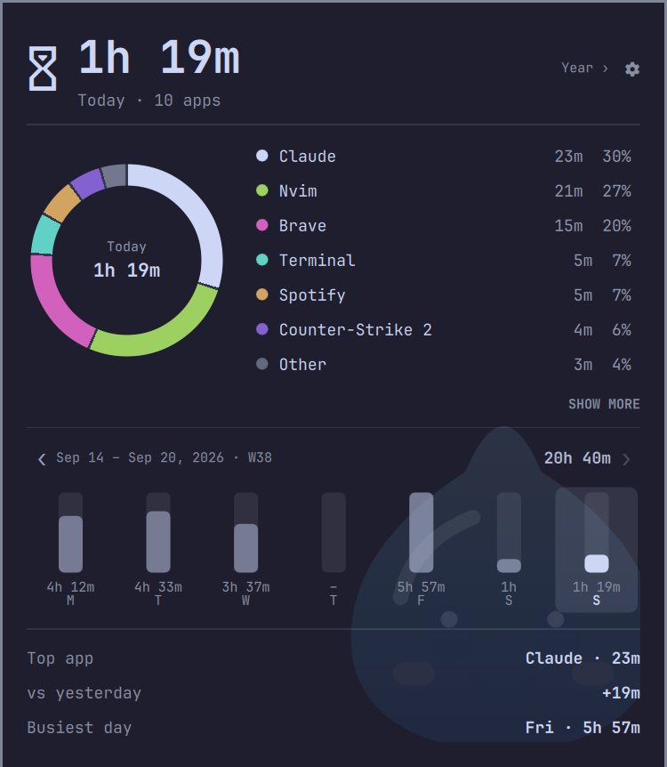
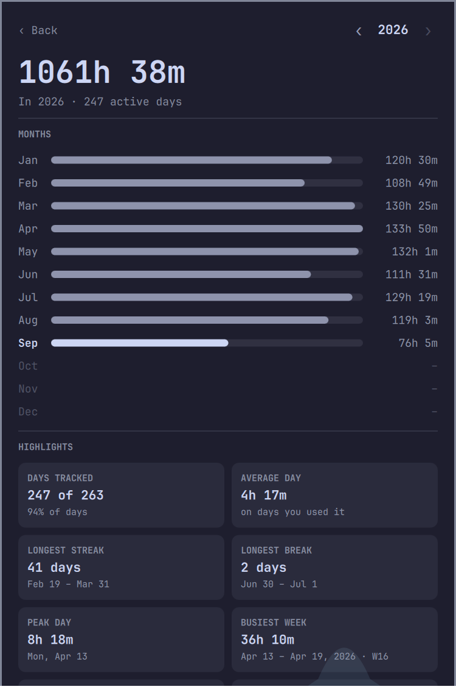
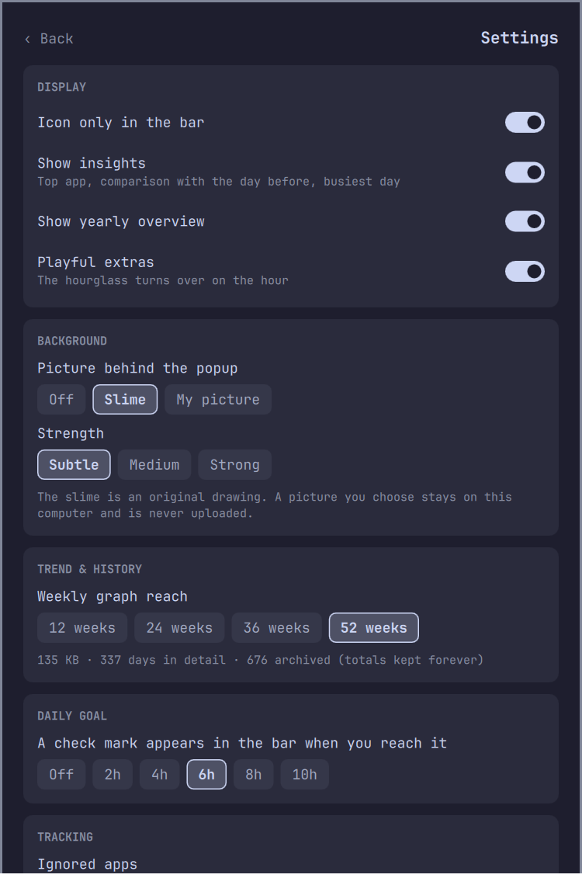

# Screen Time for Omarchy

Daily screen time per app, in your Omarchy bar. Click the widget for a popup with a donut chart of the day's apps, a week-by-week trend you can page back through, a few insights, a yearly overview with month-by-month bars and highlights, a settings menu, and an optional faint background picture.

Fully local: it reads which window is focused, adds up the time, and saves it to a file on your machine. It makes no network requests.

<p align="center">
  
</p>

<p align="center">
  
  &nbsp;
  
</p>

*Screenshots use made-up data.*

## Requirements

- **Omarchy 4** with **Hyprland**. Built and tested on Omarchy 4.0.0.alpha with Quickshell 0.3.1 and Qt 6.11. It needs Qt 6.6 or newer (the donut chart uses Qt's curve renderer), which current Omarchy provides.
- A **Nerd Font** for the icon (Omarchy's default font has it).
- **`python3`** (already on Omarchy). Without it the plugin still tracks, but terminals show under the terminal's own name instead of the command running in them.

## Install, update, remove

```bash
omarchy plugin add https://github.com/nabdalla-prog/Rimuru-screentime.git --enable
```

**Update:**

```bash
omarchy plugin update
omarchy restart shell
```

Omarchy keeps a plugin's code running until the shell restarts, so an update only takes effect after `omarchy restart shell` (the bar blinks for a moment). From version 0.6.1 on, the plugin notices when newer files are installed and shows a notice in the bar tooltip and at the top of the popup until you restart.

**Remove:**

```bash
omarchy plugin remove rimuru.screentime
```

That removes the plugin and its bar entry. Your history stays in `~/.local/share/omarchy-screentime/`; delete that folder too if you want it gone.

## Use

**In the bar:** left click opens the popup, right click switches between icon + time and icon only.

**In the popup:**

- **Donut and list:** the biggest six apps plus "Other" (apps under 3% are folded into it). Hover a slice or a row to spotlight it. *Show more* lists every app that's in "Other".
- **Week trend:** one Monday-to-Sunday page at a time, with the date range and ISO week number (`Aug 31 – Sep 6, 2026 · W36`). The arrows or the mouse wheel page back through up to 52 weeks, as far as your history goes. Click a day to inspect it (the donut, total and insights follow), then click it again, or *Back to today*, to return. Click the week's total to flip between time and its share of the week's 168 hours. A ★ marks your busiest week ever.
- **Insights:** the day's top app, how it compares with the day before, and the busiest day of the week on screen.
- **Yearly overview:** click *Year ›* (or the hourglass) for a bar per month and a set of highlights for that year, with arrows to go back through every recorded year:
  - *Days tracked* out of the days measured. A year is measured from Jan 1, or from your first recorded day if you started mid-year, up to today (or Dec 31).
  - *Average day*, on days you used the computer.
  - *Longest streak* of consecutive days in use, and *longest break* of consecutive days off, each with its dates.
  - *Peak day* and *busiest week* (Monday to Sunday; needs two weeks of data).
  - *Top months*, the *recharge month* (your lightest month, counted only once it has two weeks of data), and a *weekday rhythm* chart of your average time on each weekday.

| Key | Action |
|---|---|
| `←` `→` (or `h` `l`) | Previous / next day, following it across weeks |
| `[` `]` | Older / newer week |
| `t` | Back to today |
| `1`–`7` | Inspect Monday … Sunday of the week on screen |
| `y` | Open / close the yearly overview (there, `←` `→` or `[` `]` change the year) |
| `c` | Open the settings menu |
| `f` | Show each control's key as a small cap (any other key hides them) |
| `m` | Show more / less apps |
| `s` | Week total: time / share of the week |
| `↑` `↓` (or `k` `j`) | Scroll, if the popup is taller than the screen |
| `Esc` | Leave the yearly overview or settings, or close the popup |

## What is tracked

- Time is counted per app once per second while its window has focus.
- **Terminals** are filed under the command running in them (`nvim`, `btop`, `claude`), not the terminal's name, and follow along as you start and stop commands. A bare shell prompt counts as "Terminal". If a terminal has several tabs, the window title is used to pick the right one.
- **Steam games** show their title instead of `steam_app_730`. Non-Steam shortcuts such as Battle.net use the window title.
- **Browsers** are folded to one name (`brave-browser` and `brave` are both "Brave"), and **Chromium web apps** ("install as app") are filed under their site, the same across profiles.
- Nothing is counted while the session is locked, while the screensaver or a desktop portal dialog has focus, when no window has focus, for apps you ignore, or while the machine is asleep. Time that crosses midnight is split between the two days.

History is stored at `~/.local/share/omarchy-screentime/history.json`. The last 365 days are kept in full (time per app). Older days are rolled into an archive that keeps just each day's total, forever, so the yearly overview can always go back to your first day. Only the per-app breakdown of old days is forgotten. Ignoring an app hides its time on recent days but can't be applied to archived days, which are totals only. Delete the file to reset. If the file ever becomes unreadable, a copy is kept next to it as `history.json.corrupt-<timestamp>` and tracking starts fresh.

## Settings

Open the menu with the gear in the popup, the `c` key, or `omarchy-shell rimuru.screentime settings`. Everything is saved in this widget's entry in `~/.config/omarchy/shell.json`.

- **Display:** icon only in the bar, show insights, show the yearly overview, and "playful extras" (the hourglass turns over on the hour).
- **Background:** a faint picture behind the popup: *Off*, the built-in *Slime*, or *My picture* (see below). *Strength* is Subtle, Medium or Strong, and even Strong stays a watermark.
- **Trend & history:** how far the weekly graph pages back (12, 24, 36 or 52 weeks), and how much space your history takes.
- **Daily goal:** off, or 2, 4, 6, 8 or 10 hours. Once today reaches it, a ✓ appears in the bar, the tooltip shows the time left, and the popup shows a progress bar.
- **Tracking:**
  - *Ignored apps* are never counted and their past time is hidden. The apps you've used today are listed as chips: tap one to ignore it, or type a name and press Enter.
  - *Custom names* rename an app in the popup. Apps given the same name are merged into one row.
- **Danger zone:** *Reset today* (three clicks: RESET, SURE?, REALLY?) clears only today. *Wipe all history* (four clicks) erases every day including the archive, with no undo. Waiting a few seconds or moving off the button starts over.

The same settings can be changed from the terminal:

```bash
omarchy-shell rimuru.screentime goal 6              # daily goal in hours, 0 = off
omarchy-shell rimuru.screentime ignore rofi         # never count this app
omarchy-shell rimuru.screentime unignore rofi
omarchy-shell rimuru.screentime rename zen Browser  # show an app under your own name
omarchy-shell rimuru.screentime rename zen ""       # remove the custom name
omarchy-shell rimuru.screentime apps                # today's apps, to see the names to use
```

or written by hand in `shell.json`:

```json
{ "id": "rimuru.screentime", "dailyGoalHours": 6, "ignoredApps": ["rofi", "wofi"], "appNames": { "zen": "Browser" },
  "weeks": 24, "iconOnly": false, "showInsights": true, "showYearLink": true, "playful": true,
  "backgroundMode": "slime", "backgroundStrength": 1, "backgroundImage": "", "backgroundFit": "fill" }
```

Use the name shown in the popup (`Brave`, `Nvim`) or the raw window class (`brave-browser`) for ignoring and renaming; case doesn't matter.

Other commands: `open`, `close`, `toggle`, `year` and `settings`, all bindable to a key, `background off|slime|/path/to/picture.png`, and `status`. There is deliberately no command that wipes history.

## Background picture

By default a small blue slime sits very faintly in the lower-right corner of the popup. It is an original drawing made for this plugin; the plugin does not include artwork from any anime, game or other property. The plugin's name refers to Rimuru Tempest from *That Time I Got Reincarnated as a Slime*; this is an unofficial fan project and is not affiliated with or endorsed by the creators or publishers of the series.

To use a picture of your own, such as a wallpaper of a character you like, choose *My picture* in the settings and type its path, or run:

```bash
omarchy-shell rimuru.screentime background ~/Pictures/rimuru.png
```

- *Fill* covers the whole popup (cropping the picture), and *Fit* shows all of it in the corner, which suits a picture with a transparent background.
- Formats: png, jpg, webp, gif, bmp and svg. `~`, quotes, `file://` links and spaces in the path all work.
- The picture is loaded from where it is. It stays on your computer and is never copied into this plugin or uploaded. If it can't be loaded, nothing is drawn and the settings menu says why.
- The picture sits behind everything and never takes a click. Turn it off any time in the settings, or with `omarchy-shell rimuru.screentime background off`.

## Themes

The plugin follows your Omarchy theme: colours, fonts and the danger colour come from the shell, so switching themes (`omarchy theme set …`) changes the bar widget and popup straight away, light or dark, with no restart.

## Privacy and security

Nothing leaves your computer: there is no network code, no account and no telemetry. History and settings are plain files you can read and delete.

Omarchy plugins run inside the shell with your user's permissions and are not sandboxed, so read the code before you install any of them. This one is small: `js/Model.js` (pure logic), `qml/Service.qml` (tracking and saving), `qml/BarWidget.qml`, `qml/Panel.qml`, `qml/Dashboard.qml`, `qml/YearView.qml`, `qml/SettingsView.qml` and `qml/components/` (UI) and `python/resolve_app.py` (looks up the terminal command or Steam title; it only reads `/proc`, `hyprctl activewindow` and Steam's `appmanifest` files, and writes nothing). The other commands it runs are `mkdir -p` and `cp` on its own data folder, and `omarchy-shell lock isLocked` to see whether the screen is locked. It only ever writes to its own data folder and to its own entry in `~/.config/omarchy/shell.json`, and only when you change a setting. To report a security problem see [SECURITY.md](SECURITY.md).

## Troubleshooting

Start with `omarchy-shell rimuru.screentime status`. It prints one line: whether the service is running, which window it sees, and the plugin version. Attach it to any bug report.

| Problem | What to check |
|---|---|
| Nothing appears in the bar | `omarchy plugin list` should show `rimuru.screentime` as `enabled`. If not: `omarchy plugin enable rimuru.screentime`. |
| The widget shows `status` with `service=missing` | Restart the shell: `omarchy restart shell`. |
| The popup looks old after an update, or shows an update notice | Run `omarchy restart shell`. |
| Terminals show as `Ghostty` / `foot` instead of `nvim` | `python3 --version` must work, and `hyprctl activewindow -j` must print JSON. |
| The icon shows as an empty box | Install a Nerd Font (Omarchy's default already includes it). |
| A Steam game shows as `steam_app_730` | Steam's `appmanifest_*.acf` file for it wasn't found in the usual library folders. |
| Time isn't counted while I'm away | That is intended: the timer pauses while the session is locked or the screensaver is on. |
| Something else | Look for lines from the plugin: `journalctl --user --since '-10min' \| grep -i screentime`, then [open an issue](https://github.com/nabdalla-prog/Rimuru-screentime/issues/new/choose). |

## Known limitations

- **Tested on one machine** (Omarchy 4.0.0.alpha, Hyprland, one monitor, Ghostty and `foot` terminals, Brave). Bars at the top, bottom, left and right were checked, and the widget stacks its icon and time on vertical bars. **Not tested:** several monitors, other terminals such as kitty, alacritty or wezterm, Steam games, Chromium web apps in real use, and the pause while locked. Reports from other setups are very welcome.
- **Ghostty and other single-process terminals** run every window in one process. Windows are matched to their shell in creation order, which is right for separate windows but can guess wrong for tabs or splits.
- **Ignoring an app** hides its time on the last 365 days; older days are stored as totals only and can't be filtered.
- It depends on internals of the Omarchy shell (its service registry and widget settings), so a future Omarchy release could need a matching update.

## Development

```bash
node --test tests/*.test.js           # logic, versions and changelog checks
python3 -m unittest discover -s tests # the terminal resolver
omarchy plugin validate .             # check the manifest
ln -s "$PWD" ~/.config/omarchy/plugins/rimuru.screentime
omarchy-shell shell rescanPlugins && omarchy plugin enable rimuru.screentime
```

The shell keeps running a plugin's code until it restarts, so after editing any file run `omarchy restart shell` (it briefly blinks the bar). `tools/preview.sh` renders the popup on its own with made-up data, which is handy for working on the look without touching your real history (see [CONTRIBUTING.md](CONTRIBUTING.md)).

## Contributing, support and license

Bug reports, ideas and pull requests are welcome; see [CONTRIBUTING.md](CONTRIBUTING.md). Changes are listed in [CHANGELOG.md](CHANGELOG.md). Everyone taking part is asked to follow the [code of conduct](CODE_OF_CONDUCT.md).

[MIT](LICENSE)
